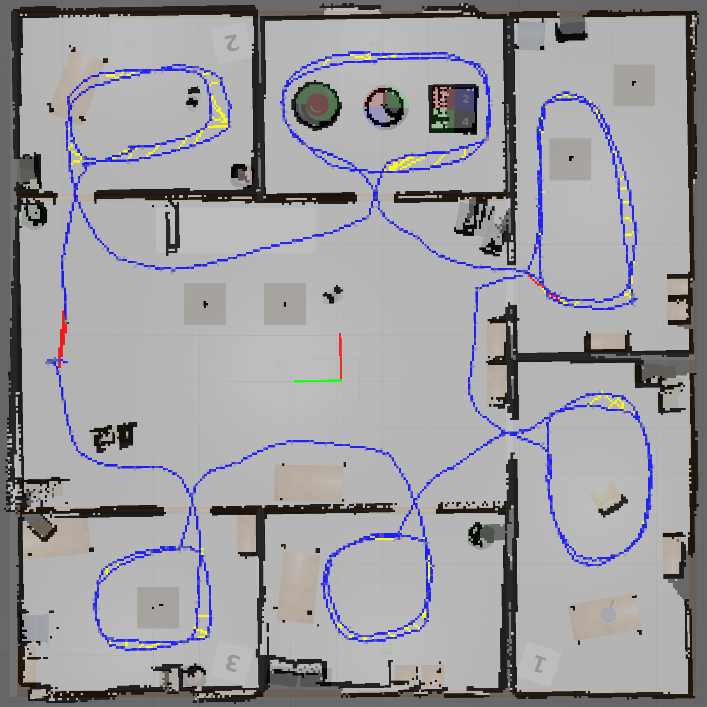

# mapping-bot

## Overview

This repository contains the following package:
* **mapping_bot**: A 4-wheeled skid-steer drive robot equipped with a RGBD camera and a Hokuyo lidar in a Gazebo environment. The generated graph is stored inside the `databases` directory and can be used afterwards for localization. `rtabmapviz` is used for visualization during SLAM, while `rviz` is used during localization. The robot is controlled with the `teleop_twist_keyboard` package.

### License

The source code is released under an [MIT license](LICENSE).

**Author/Maintainer: George Sotirchos**

The mapping-bot package has been tested under [ROS](https://www.ros.org) Kinetic in a docker container on Ubuntu 20.04 (see [Running in Docker](#running-in-docker) section). This is experimental, personal project code, and possibly subject to frequent changes with any need for explanation disclaimed.



The generated database file (~500MB) containing the above graph can be downloaded from the following link:<br/>
https://drive.google.com/file/d/1b5pvZWY5gWn9cGNwS4kvx6GS7iLyPiKr/view?usp=sharing

**Note**: the numbered white cubes are not detected by the laser scan because their models contained no `<collision>` elements.

## Installation

### Building from Source

#### Dependencies

- [ros-kinetic](http://wiki.ros.org)
- [ros-kinetic-rtabmap-ros](http://wiki.ros.org/rtabmap_ros)
- [ros-kinetic-move-base](http://wiki.ros.org/move_base)
- [ros-kinetic-teleop-twist-keyboard](http://wiki.ros.org/teleop_twist_keyboard)

#### Building

To build from source, with ROS Kinetic on Ubuntu 16.04, clone the latest version from this repository into your catkin workspace and compile the package with the following commands:

``` bash
mkdir -p /catkin_ws/src
cd catkin_ws/src
git clone https://github.com/gsotirchos/mapping-bot
cd ../
rosdep install --from-paths . --ignore-src
catkin_make
# place the downloaded database file at ./src/mapping-bot/mapping_bot/databases/rtabmap.db
```

### Running in Docker

Install [Docker](https://docs.docker.com/get-docker/).

Spin up a container with GUI forwarding for X11 applications:

``` bash
docker run \
    -ti \
    --rm \
    --network=host \
    --env="DISPLAY" \
    --env QT_X11_NO_MITSHM=1 \
    --device=/dev/dri:/dev/dri \
    --volume="$HOME/.Xauthority:/root/.Xauthority:rw" \
    --name ros-container \
    mjenz/ros-kinetic-desktop-full \
    bash
```

This downloads the `mjenz/ros-kinetic-desktop-full` image from [mjenz](https://hub.docker.com/u/mjenz)'s Docker repository, indicates that it requires an interactive terminal (`-t`, `-i`), gives it a name (`--name`), removes it after you exit the container (`--rm`), sets the required environment variables (`--env`) and access to local resources (`--device`, `--volume`) to be able to launch graphical applications (Gazebo, RViz, rqt_graph, etc.), and runs a command (`bash`).

Now, continue with the instructions from the [Building](#building) section.

## Usage

1. Start the Gazebo environment containing the robot:

    ``` bash
    roslaunch mapping_bot world.launch
    ```

2. Start the `teleop_twist_keyboard` node:

    ``` bash
    roslaunch mapping_bot teleop.launch
    ```

3. Start the `rtabmap` and `rtabmapviz` nodes in *SLAM* mode:

    ``` bash
    roslaunch mapping_bot mapping.launch
    ```

   Alternatively, start the `rtabmap` and `rtabmapviz` nodes in *localization* mode:

    ``` bash
    roslaunch mapping_bot localization.launch
    ```

## Launch files

* [**mapping_bot/launch/world.launch**](mapping_bot/launch/world.launch): A Gazebo simulation is opened and a 4-wheeled skid-steer drive robot equipped with an RGBD camera and a Hokuyo lidar is spawned in an office environment.

* [**mapping_bot/launch/mapping.launch**](mapping_bot/launch/mapping.launch): Starts the `rtabmap` node for *SLAM*, and the `rtabmapviz` node for visualization.

* [**mapping_bot/launch/localization.launch**](mapping_bot/launch/localization.launch): Starts the `rtabmap` node for *localization*, and the `rviz` node for visualization.

     Arguments:

     - **`rviz`**: Whether to launch an RViz window.<br/>
        Default: `true`

     - **`move_base`**: Whether to start a `move_base` node.<br/>
        Default: `false`

## Nodes

### rtabmap

Following are the `rtabmap`'s published and subscribed topics of main interest for the current application.

#### Published Topics

* **`/map`** ([nav_msgs/OccupancyGrid](http://docs.ros.org/en/api/nav_msgs/html/msg/OccupancyGrid.html))

    Mapping Occupancy grid generated with laser scans. Remapped from `grid_map`.

#### Subscribed Topics

* **`/rgb/image_raw`** ([sensor_msgs/Image](http://docs.ros.org/en/api/sensor_msgs/html/msg/Image.html))

    Image from the camera. Remapped from `rgb/image`.

* **`/rgb/camera_info`** ([sensor_msgs/CameraInfo](http://docs.ros.org/en/api/sensor_msgs/html/msg/CameraInfo.html))

    RGB Camera metadata.
* **`/depth/image_raw`** ([sensor_msgs/Image](http://docs.ros.org/en/api/sensor_msgs/html/msg/Image.html))

    Depth measurements from the camera. Remapped from `depth/image`.

* **`/scan`** ([sensor_msgs/LaserScan](http://docs.ros.org/en/api/sensor_msgs/html/msg/LaserScan.html))

    Laser scan stream. Remapped from `scan`.

## Bugs & Feature Requests

Please report bugs and request features using the [Issue Tracker](https://github.com/gsotirchos/mapping-bot/issues).

ROS: http://www.ros.org<br/>
RTAB-Map's ROS package: https://github.com/introlab/rtabmap_ros<br/>
move_base ROS package (ROS Navigation stack): https://github.com/ros-planning/navigation<br/>
teleop_twist_keyboard ROS package: https://github.com/ros-teleop/teleop_twist_keyboard
